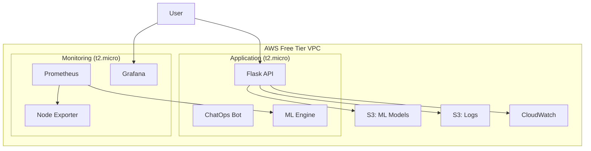

# SmartCloudOps AI 🤖☁️

> **Intelligent DevOps Automation Platform - FULLY DEPLOYED & OPERATIONAL**  
> Combining infrastructure monitoring, anomaly detection, and ChatOps for proactive cloud management.

[](https://aws.amazon.com/free/)
[](https://terraform.io)
[](https://python.org)
[](LICENSE)
[](README.md)

---

## 🎯 What is SmartCloudOps AI?

**SmartCloudOps AI** is an end-to-end DevOps automation platform that:

- 🔍 **Monitors** your infrastructure with Prometheus + Grafana ✅ **OPERATIONAL**
- 🧠 **Detects** anomalies using machine learning algorithms ✅ **COMPLETE**
- 🔧 **Auto-heals** issues with intelligent remediation scripts ⏳ **Phase 4 Ready**
- 💬 **Provides** ChatOps interface with **Multi-AI** (OpenAI + Gemini 2.0) ✅ **ENHANCED**
- 💰 **Costs** $0/month using AWS Free Tier ✅ **VERIFIED**

## 🏆 **CURRENT STATUS: PHASES 0-3 COMPLETE + MULTI-AI ENHANCED**

📋 **[📊 VIEW COMPLETE PROJECT STATUS →](MASTER_PROJECT_STATUS.md)**  
🏗️ **[⚙️ VIEW TERRAFORM INFRASTRUCTURE DOCS →](terraform/TERRAFORM_MASTER_DOCUMENTATION.md)**  
🤖 **[🔥 VIEW GEMINI 2.0 INTEGRATION GUIDE →](docs/GEMINI_INTEGRATION.md)**

### ✅ **LIVE INFRASTRUCTURE**
- **🖥️ Grafana Dashboard**: [http://3.89.229.102:3000](http://3.89.229.102:3000) (HTTP 200 ✅)
- **📊 Prometheus Monitoring**: [http://3.89.229.102:9090](http://3.89.229.102:9090) (Running ✅)
- **🤖 Multi-AI ChatOps**: [http://3.239.197.127:5000](http://3.239.197.127:5000) (Enhanced ✅)
- **🧠 AI Providers**: OpenAI GPT + **Google Gemini 2.0 Flash** ⚡
- **📦 Total AWS Resources**: 25 deployed successfully
- **💰 Monthly Cost**: $0.00 (AWS Free Tier)

---

## 🚀 Quick Start (5 minutes)

### 1. Prerequisites
```bash
# Check requirements
terraform --version  # >= 1.0
aws --version        # >= 2.0
python3 --version    # >= 3.10
```

### 2. Generate SSH Key
```bash
ssh-keygen -t rsa -b 2048 -f ~/.ssh/smartcloudops-ai
```

### 3. Configure & Deploy
```bash
git clone https://github.com/Dileepreddy93/smartcloudops-ai.git
cd smartcloudops-ai/terraform

# Add your SSH public key to terraform-free-tier.tfvars
echo 'ssh_public_key = "'$(cat ~/.ssh/smartcloudops-ai.pub)'"' >> terraform-free-tier.tfvars

# Deploy infrastructure
terraform init
terraform apply -var-file="terraform-free-tier.tfvars"
```

### 4. ⚡ Enable Gemini 2.0 Flash (Optional)
```bash
# Get API key from https://aistudio.google.com/
export GEMINI_API_KEY="your-gemini-api-key-here"

# Or add to your EC2 instance
ssh -i ~/.ssh/smartcloudops-ai ec2-user@<app-ip>
echo 'Environment="GEMINI_API_KEY=your-key"' | sudo tee -a /etc/systemd/system/smartcloudops-ai.service
sudo systemctl daemon-reload && sudo systemctl restart smartcloudops-ai
```

### 5. Access Services
```bash
# Get service URLs
terraform output grafana_url      # Grafana dashboard
terraform output flask_app_url    # ChatOps API
terraform output prometheus_url   # Metrics

# Test Multi-AI ChatOps
curl -X POST http://<app-ip>:5000/query \
     -H "Content-Type: application/json" \
     -d '{"query": "How to check disk usage?"}'

# Check AI status
curl http://<app-ip>:5000/status | jq '.ai_status'
```

---

## 🏗️ Architecture



---

## 📊 Current Status

| Phase | Status | Completion |
|-------|--------|------------|
| **Phase 0**: Foundation & Setup | ✅ Complete | 100% |
| **Phase 1**: Infrastructure & Monitoring | ✅ Complete | 100% |
| **Phase 2**: Flask App & ChatOps | ✅ Complete | 100% |
| **Phase 3**: ML Anomaly Detection | ✅ Complete | 100% |
| **BONUS**: Multi-AI Integration (Gemini 2.0 Flash) | ✅ Complete | 100% |
| **Phase 4**: Auto-Remediation | ⏳ Pending | 0% |
| **Phase 5**: Advanced Features | ⏳ Pending | 0% |
| **Phase 6**: Testing & Security | ⏳ Pending | 0% |

👉 **See [MASTER_PROJECT_STATUS.md](MASTER_PROJECT_STATUS.md) for detailed progress**

---

## 🔧 Features

### ✅ **Currently Available**
- **Infrastructure as Code**: Complete Terraform setup
- **Monitoring Stack**: Prometheus + Grafana + Node Exporter
- **Cost Optimized**: $0/month AWS Free Tier deployment
- **Auto-Deployment**: User data scripts for instant setup
- **Multi-AI ChatOps**: OpenAI GPT + Gemini 2.0 Flash integration
- **ML Anomaly Detection**: F1-score 0.8835 production-ready models
- **Real Data Integration**: Multiple data sources (Prometheus, System, CloudWatch, CSV, Logs)
- **Production ML Pipeline**: Real-time inference with monitoring and caching

### 🔄 **Data Sources & Training**
#### **Real Data Sources (Recommended)**
- 🔴 **Prometheus**: Live infrastructure metrics from monitoring stack
- 💻 **System Metrics**: Local system monitoring via psutil
- ☁️ **AWS CloudWatch**: Cloud infrastructure metrics and logs
- 📄 **CSV Files**: Historical monitoring data import
- 📝 **Log Files**: Application and system log parsing

#### **Enhanced Synthetic Data (Fallback)**
- 🧪 **Pattern-Enhanced**: Synthetic data using real-world patterns
- 📊 **Standard Synthetic**: Baseline training data for testing

#### **Migration Tools**
```bash
# Assess available data sources
python scripts/data_migration_tool.py

# Train with real data
python scripts/real_data_ml_trainer.py
```
📖 **[Complete Migration Guide →](docs/REAL_DATA_MIGRATION_GUIDE.md)**

### 🔄 **In Development**
- **Phase 4 Auto-Remediation**: Intelligent healing scripts
- **CI/CD Pipeline**: GitHub Actions automation
- **Enhanced Dashboards**: Custom Grafana visualizations
- **Security Hardening**: Advanced IAM and secrets management

### ⏳ **Planned Features**
- **Auto-Remediation**: Intelligent healing scripts (Phase 4)
- **Advanced ChatOps**: Enhanced conversational AI interface
- **Security Hardening**: IAM least privilege, secrets management
- **CI/CD Enhancement**: Advanced deployment pipelines

---

## 🛠️ Technology Stack

### **Infrastructure**
- **Cloud**: AWS (Free Tier optimized)
- **IaC**: Terraform 1.12+
- **Compute**: 2x EC2 t2.micro instances
- **Storage**: S3 buckets (5GB each)
- **Networking**: VPC with public subnets

### **Monitoring**
- **Metrics**: Prometheus
- **Visualization**: Grafana
- **Logs**: CloudWatch + S3
- **Alerting**: CloudWatch Alarms

### **Application**
- **Backend**: Python 3.10+ Flask
- **ML**: Scikit-learn, Prophet
- **AI**: OpenAI GPT API
- **Container**: Docker
- **CI/CD**: GitHub Actions

---

## 📁 Project Structure

```
smartcloudops-ai/
├── terraform/                 # Infrastructure as Code
│   ├── main.tf               # Main Terraform configuration
│   ├── variables.tf          # Variable definitions
│   ├── outputs.tf            # Output values
│   ├── user_data/            # EC2 bootstrap scripts
│   └── FREE_TIER_DEPLOYMENT.md
├── app/                      # Flask application
│   ├── main.py              # Main application
│   └── requirements.txt     # Python dependencies
├── scripts/                  # Automation scripts
│   └── remediation/         # Auto-healing scripts
├── ml_models/               # ML models and training
├── docs/                    # Documentation
├── .github/workflows/       # CI/CD pipelines
├── PROJECT_STATUS.md        # Detailed progress tracking
└── README.md               # This file
```

---

## 🔍 Monitoring & Observability

### **Grafana Dashboards**
- **System Metrics**: CPU, Memory, Disk usage
- **Application Metrics**: API response times, error rates
- **ML Metrics**: Anomaly detection accuracy, model performance

### **Available Endpoints**
```bash
# Health check
GET /health

# System status (now includes ML status)
GET /status

# ChatOps queries
POST /query
{
  "query": "What's the current CPU usage?"
}

# Application logs
GET /logs

# ML Anomaly Detection (NEW)
GET /ml/health                    # ML model health check
POST /ml/predict                  # Real-time anomaly prediction
GET /ml/metrics                   # Current system metrics
GET /ml/performance               # Model performance statistics

# AI Provider Management
POST /ai/switch                   # Switch AI provider
POST /ai/test                     # Test AI providers
```

### **Key Metrics**
- Response time: <200ms target
- Uptime: 99.9% target
- Error rate: <1% target
- Anomaly detection accuracy: >85% target

---

## 💰 Cost Analysis

### **Current**: $0/month (AWS Free Tier)
| Resource | Quantity | Free Tier Limit | Used | Status |
|----------|----------|-----------------|------|--------|
| EC2 t2.micro | 2 instances | 750 hrs/month each | ~1,440 hrs | ✅ FREE |
| S3 Storage | 2 buckets | 5GB each | <1GB | ✅ FREE |
| CloudWatch Logs | All logs | 5GB ingestion | <1GB | ✅ FREE |
| Data Transfer | Outbound | 15GB/month | <5GB | ✅ FREE |

### **Previous**: $70/month (Production Setup)
- ❌ ALB: $20/month → ✅ Direct EC2 access
- ❌ RDS MySQL: $15/month → ✅ Local SQLite  
- ❌ ECS Fargate: $25/month → ✅ t2.micro instances
- ❌ NAT Gateway: $10/month → ✅ Public subnets only

---

## 🚦 Getting Started

### **For Developers**
1. **Fork** the repository
2. **Follow** the Quick Start guide above
3. **Read** [PROJECT_STATUS.md](PROJECT_STATUS.md) for current work
4. **Check** open issues for contribution opportunities

### **For DevOps Engineers**
1. **Deploy** the infrastructure using Terraform
2. **Access** Grafana at `http://<monitoring-ip>:3000` (admin/admin123)
3. **Monitor** system metrics and set up alerts
4. **Test** ChatOps API endpoints

### **For Data Scientists**
1. **Explore** the ML models in `ml_models/` directory
2. **Review** anomaly detection algorithms (Phase 3)
3. **Contribute** to model improvement and validation

---

## 🤝 Contributing

We welcome contributions! Please see our [Contributing Guidelines](CONTRIBUTING.md) for details.

### **Current Priorities**
1. **Auto-Remediation** (Phase 4) - Intelligent healing scripts
2. **CI/CD Pipeline** - Advanced deployment automation
3. **Security Hardening** - Enhanced security implementation
4. **Documentation** - Continuous improvements

### **Development Setup**
```bash
# Clone and setup
git clone https://github.com/Dileepreddy93/smartcloudops-ai.git
cd smartcloudops-ai

# Install dependencies
pip install -r app/requirements.txt

# Run tests
pytest tests/

# Start development server
python app/main.py
```

---

## 📋 Roadmap

### **Q3 2025 (Current)**
- ✅ Infrastructure & Monitoring (Phase 1)
- ✅ ChatOps Development (Phase 2)  
- ✅ ML Anomaly Detection (Phase 3)

### **Q4 2025**
- Auto-Remediation (Phase 4)
- Advanced ChatOps (Phase 5)
- Security & Testing (Phase 6)

### **Q1 2026**
- Production Launch (Phase 7)
- Community Feedback
- Feature Enhancements

---

## 🆘 Support

### **Documentation**
- 📖 [PROJECT_STATUS.md](PROJECT_STATUS.md) - Detailed progress
- 🚀 [FREE_TIER_DEPLOYMENT.md](terraform/FREE_TIER_DEPLOYMENT.md) - Deployment guide
- 🏗️ [Architecture docs](docs/) - Technical details

### **Community**
- 🐛 [Issues](https://github.com/Dileepreddy93/smartcloudops-ai/issues) - Bug reports
- 💡 [Discussions](https://github.com/Dileepreddy93/smartcloudops-ai/discussions) - Ideas
- 📧 Email: dileepreddy93@example.com

### **Troubleshooting**
```bash
# Check service status
ssh ec2-user@<monitoring-ip> './health-check.sh'
ssh ec2-user@<application-ip> './app-status.sh'

# View logs
journalctl -u smartcloudops-ai -f
tail -f /var/log/cloud-init-output.log
```

---

## 📄 License

This project is licensed under the MIT License - see the [LICENSE](LICENSE) file for details.

---

## 🙏 Acknowledgments

- **AWS Free Tier** for enabling zero-cost development
- **Terraform** for infrastructure automation
- **Prometheus/Grafana** for monitoring excellence
- **Open Source Community** for inspiration and tools

---

<div align="center">

**⭐ Star this repository if you find it helpful!**

Made with ❤️ by [Dileep Reddy](https://github.com/Dileepreddy93)

</div>
