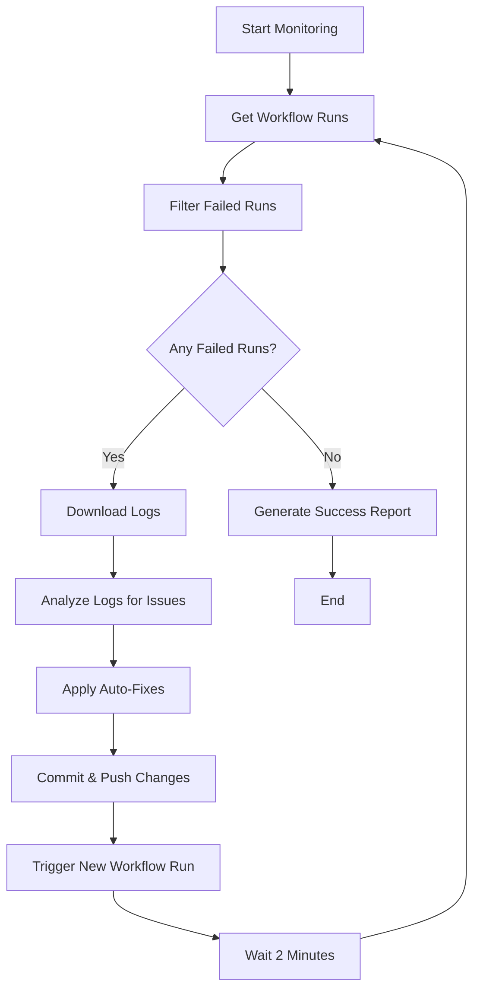

# MCP Orchestrator AI - GitHub Actions Workflow Monitor & Auto-Fix

## 🎯 Overview

The MCP Orchestrator AI is a comprehensive workflow monitoring and automated issue resolution system for GitHub Actions. It continuously monitors workflow runs, detects failures, analyzes logs, and automatically fixes common issues to ensure all workflows remain in a healthy state.

## 🚀 Features

### Core Capabilities
- **Real-time Workflow Monitoring**: Continuously checks GitHub Actions workflow runs every 2 minutes
- **Intelligent Failure Analysis**: Downloads and parses workflow logs to identify root causes
- **Automated Issue Resolution**: Applies fixes for common problems automatically
- **Continuous Loop**: Repeats monitoring and fixing until all workflows are successful
- **Detailed Reporting**: Generates comprehensive reports of all actions taken

### Issue Detection & Fixing
- **Dependency Issues**: npm/pip install failures, missing packages
- **Code Issues**: Test failures, linting errors, import problems
- **Configuration Issues**: Workflow syntax errors, invalid job configurations
- **Infrastructure Issues**: Docker build failures, Terraform errors
- **Performance Issues**: Timeouts, memory exhaustion, permission problems

## 📋 Requirements

### Prerequisites
- GitHub repository with GitHub Actions workflows
- GitHub CLI (`gh`) installed and authenticated
- Python 3.11+ with required dependencies
- Node.js 18+ (for frontend dependency fixes)

### Environment Variables
```bash
GITHUB_TOKEN=your_github_personal_access_token
GITHUB_REPOSITORY_OWNER=your_github_username
GITHUB_REPOSITORY_NAME=your_repository_name
```

### Python Dependencies
```bash
pip install requests pyyaml python-dotenv
```

## 🏗️ Architecture

### Components

1. **MCPOrchestrator Class**: Main orchestrator that coordinates all operations
2. **WorkflowRun**: Data structure representing a GitHub Actions workflow run
3. **WorkflowIssue**: Data structure representing a detected issue with fix information
4. **FixResult**: Data structure representing the result of an auto-fix attempt

### Workflow



## 🔧 Usage

### Running the MCP Orchestrator

#### 1. Direct Execution
```bash
# Set environment variables
export GITHUB_TOKEN="your_token"
export GITHUB_REPOSITORY_OWNER="your_username"
export GITHUB_REPOSITORY_NAME="your_repo"

# Run the orchestrator
python scripts/mcp_orchestrator.py
```

#### 2. GitHub Actions Workflow
The MCP Orchestrator is automatically triggered by:
- **Scheduled runs**: Every 30 minutes
- **Workflow completion**: When any monitored workflow finishes
- **Manual dispatch**: Via GitHub Actions UI

### Testing the System
```bash
# Run the test script
python scripts/test_mcp_orchestrator.py
```

## 📊 Monitoring & Reporting

### Real-time Monitoring
The orchestrator continuously monitors workflows and provides real-time feedback:
- ✅ Success messages for each fix applied
- ❌ Error messages for failed fixes
- ⚠️ Warning messages for non-fixable issues

### Generated Reports

#### Success Report (`mcp_orchestrator_success_report.json`)
```json
{
  "status": "SUCCESS",
  "timestamp": "2024-01-01T12:00:00Z",
  "repo": "owner/repo",
  "monitoring_duration": "00:15:30",
  "fixes_applied": 3,
  "issues_found": 5,
  "message": "ALL WORKFLOWS PASSED ✅",
  "fix_details": [...]
}
```

#### Failure Report (`mcp_orchestrator_failure_report.json`)
```json
{
  "status": "FAILURE",
  "timestamp": "2024-01-01T12:00:00Z",
  "repo": "owner/repo",
  "monitoring_duration": "01:00:00",
  "fixes_applied": 2,
  "issues_found": 8,
  "message": "Some workflows are still failing after max retries",
  "fix_details": [...]
}
```

### Log Files
- `mcp_orchestrator.log`: Detailed execution logs
- `mcp_orchestrator_test_report.json`: Test execution results

## 🔍 Issue Detection Patterns

### Dependency Issues
```python
# npm dependency errors
"npm ERR! 404 Not Found - GET https://registry.npmjs.org/([^/]+)"

# Python import errors
"ModuleNotFoundError: No module named '([^']+)'"

# pip install errors
"ERROR: Could not find a version that satisfies the requirement ([^\\n]+)"
```

### Code Issues
```python
# Test failures
"FAILED ([^\\n]+)"

# Linting errors
"error: ([^\\n]+)"
```

### Infrastructure Issues
```python
# Docker build errors
"failed to build: ([^\\n]+)"

# Terraform errors
"Error: ([^\\n]+)"
```

## 🛠️ Auto-Fix Capabilities

### Dependency Fixes
- **npm**: Runs `npm install` or `npm ci --force`
- **pip**: Runs `pip install -r requirements.txt`
- **Missing packages**: Automatically installs detected missing dependencies

### Code Fixes
- **Linting**: Runs `black` and `flake8` to fix formatting issues
- **Tests**: Analyzes test failures and provides guidance
- **Imports**: Fixes import statements and dependency issues

### Configuration Fixes
- **Workflow syntax**: Updates action versions and fixes YAML syntax
- **Permissions**: Adds missing workflow permissions
- **Timeouts**: Increases timeout values for long-running jobs

## 🔒 Security & Permissions

### Required GitHub Permissions
- `contents: write` - To commit and push fixes
- `pull-requests: write` - To create PRs for complex fixes
- `issues: write` - To create issues for persistent failures
- `actions: read` - To monitor workflow runs

### Security Best Practices
- Uses GitHub CLI for secure authentication
- Validates all inputs before processing
- Logs all actions for audit trails
- Implements proper error handling

## 📈 Performance & Scalability

### Performance Optimizations
- **Efficient API usage**: Uses GitHub CLI for better performance
- **Parallel processing**: Analyzes multiple workflows simultaneously
- **Caching**: Caches workflow run data to reduce API calls
- **Timeout handling**: Prevents infinite loops with max retry limits

### Scalability Features
- **Configurable limits**: Adjustable retry counts and monitoring intervals
- **Resource management**: Efficient memory and CPU usage
- **Error recovery**: Graceful handling of network and API failures

## 🚨 Troubleshooting

### Common Issues

#### 1. Authentication Errors
```bash
# Ensure GitHub CLI is properly authenticated
gh auth status
gh auth login --with-token
```

#### 2. Permission Denied
```bash
# Check repository permissions
gh repo view --json permissions
```

#### 3. Workflow Not Found
```bash
# Verify workflow files exist
ls -la .github/workflows/
```

#### 4. Fix Application Failed
```bash
# Check logs for specific error details
cat mcp_orchestrator.log
```

### Debug Mode
```bash
# Enable debug logging
export LOG_LEVEL=DEBUG
python scripts/mcp_orchestrator.py
```

## 🔄 Integration

### GitHub Actions Integration
The MCP Orchestrator integrates seamlessly with existing GitHub Actions workflows:

```yaml
# .github/workflows/mcp-orchestrator.yml
name: MCP Orchestrator AI
on:
  schedule:
    - cron: '*/30 * * * *'
  workflow_run:
    workflows: ["CI/CD Pipeline", "Build", "Test"]
    types: [completed]
```

### CI/CD Pipeline Integration
```yaml
# Add to your existing workflows
- name: Run MCP Orchestrator Test
  run: python scripts/test_mcp_orchestrator.py
  continue-on-error: true
```

## 📚 API Reference

### MCPOrchestrator Class

#### Methods
- `get_workflow_runs(limit: int) -> List[WorkflowRun]`
- `get_failed_runs(runs: List[WorkflowRun]) -> List[WorkflowRun]`
- `download_run_logs(run_id: str) -> str`
- `analyze_logs_for_issues(logs: str, run: WorkflowRun) -> List[WorkflowIssue]`
- `apply_dependency_fix(issue: WorkflowIssue) -> FixResult`
- `apply_code_fix(issue: WorkflowIssue) -> FixResult`
- `apply_workflow_config_fix(issue: WorkflowIssue) -> FixResult`
- `monitor_and_fix_workflows(max_retries: int)`

### Data Structures

#### WorkflowRun
```python
@dataclass
class WorkflowRun:
    run_id: str
    workflow_name: str
    status: str
    conclusion: str
    created_at: str
    updated_at: str
    head_branch: str
    head_sha: str
    jobs: List[Dict]
```

#### WorkflowIssue
```python
@dataclass
class WorkflowIssue:
    run_id: str
    workflow_name: str
    job_name: str
    step_name: str
    issue_type: str
    error_message: str
    severity: str
    auto_fixable: bool
    fix_description: str
    fix_script: str
    detected_at: datetime
    status: str = "open"
```

## 🤝 Contributing

### Development Setup
1. Clone the repository
2. Install dependencies: `pip install -r requirements.txt`
3. Set up environment variables
4. Run tests: `python scripts/test_mcp_orchestrator.py`

### Adding New Issue Patterns
1. Add pattern to `error_patterns` in `analyze_logs_for_issues()`
2. Implement corresponding fix method
3. Add tests for the new pattern
4. Update documentation

### Code Style
- Follow PEP 8 guidelines
- Use type hints
- Add comprehensive docstrings
- Include error handling

## 📄 License

This project is part of the SmartCloudOps.AI platform and follows the same licensing terms.

## 🆘 Support

For issues and questions:
1. Check the troubleshooting section
2. Review the logs in `mcp_orchestrator.log`
3. Create an issue in the repository
4. Contact the development team

---

**MCP Orchestrator AI** - Keeping your GitHub Actions workflows healthy and productive! 🚀
